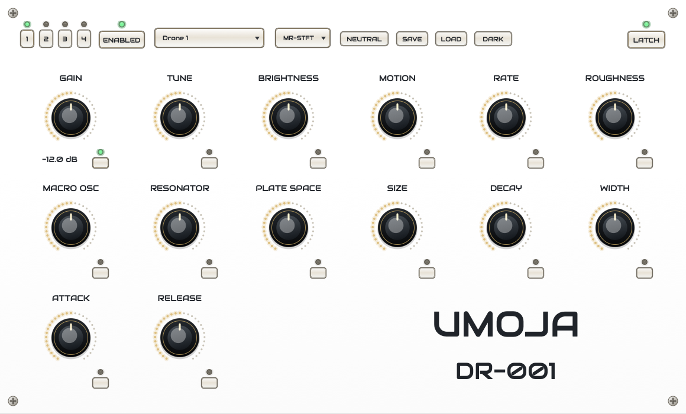

# Hemerodromos Drone

<p align="center">
  
</p>

<p align="center">
  
</p>

Hemerodromos Drone is a beta JUCE Standalone and VST3 instrument for fitting
drone source recordings into compact, real-time synthesizer banks.

The current beta plugin is branded `UMOJA DR-001`. It supports up to four
independent drone layers, profile-aware fitted soundbanks, neutral-centered
controls, preset save/load, and a rack-style GUI.

## Current Beta

Download the current macOS arm64 beta:

- [VST3 plugin zip](https://github.com/gbrouwer/Hemerodromos/releases/download/v0.1.0-beta.1/Hemerodromos-Drone-v0.1.0-beta.1-macos-arm64-vst3.zip)
- [Standalone app zip](https://github.com/gbrouwer/Hemerodromos/releases/download/v0.1.0-beta.1/Hemerodromos-Drone-v0.1.0-beta.1-macos-arm64-standalone.zip)
- [Release notes and checksums](https://github.com/gbrouwer/Hemerodromos/releases/tag/v0.1.0-beta.1)

Start here:

- [Beta release notes](docs/beta-release.md)
- [Full install-to-soundbank walkthrough](docs/walkthrough-install-to-soundbank.md)
- [Soundbank update pipeline](docs/soundbank-update-pipeline.md)
- [Fitting model notes](docs/dronefit-fitting.md)

## Local Setup

```bash
git submodule update --init --recursive
uv sync --dev
uv run python scripts/check_capabilities.py --strict
```

Build the plugin:

```bash
cmake -S . -B build -G Ninja -DCMAKE_BUILD_TYPE=RelWithDebInfo
cmake --build build
```

The VST3 build output is:

```text
build/HemerodromosDrone_artefacts/RelWithDebInfo/VST3/Hemerodromos Drone.vst3
```

## Updating The Soundbank

User-provided audio belongs under `audio/base/`. Treat that directory as
protected source material. Generated outputs under `runs/`, `reports/`,
`renders/`, `assets/fitted/`, `build/`, and the installed VST3 bundle are
replaceable.

Check status:

```bash
uv run python scripts/update_soundbank.py --mode status
```

Process new samples and rebuild/install the VST3:

```bash
uv run python scripts/update_soundbank.py --mode new --yes
```

Regenerate both current comparison profiles:

```bash
uv run python scripts/update_soundbank.py --mode all \
  --fit-version v001_mrstft \
  --duplicate-policy warn \
  --yes

uv run python scripts/update_soundbank.py --mode all \
  --fit-version v001_srstft \
  --no-multi-resolution-stft-loss \
  --stft-fft-sizes 2048 \
  --duplicate-policy warn \
  --yes
```

## Documentation Site

The Hugo/Hextra docs source lives in `docs-site/` and is regenerated from
Markdown files under `docs/`.

Build locally:

```bash
scripts/build_docs_site.sh
```

Serve locally:

```bash
scripts/serve_docs_site.sh
```

Regenerate the plugin UI screenshot used by the README and docs home:

```bash
cmake --build build --target HemerodromosScreenshot
build/HemerodromosScreenshot_artefacts/RelWithDebInfo/HemerodromosScreenshot \
  docs/assets/vst3-screenshot.png
```

## GitHub Pages

GitHub Pages is configured in
[.github/workflows/pages.yml](.github/workflows/pages.yml). When `main` is pushed
to GitHub, the workflow builds the Hextra docs site and deploys the generated
`public/` artifact.

Expected Pages URL:

```text
https://gbrouwer.github.io/Hemerodromos/
```

In the GitHub repository settings, set **Pages > Build and deployment > Source**
to **GitHub Actions**.

## Validation

```bash
uv run pytest
cmake --build build
scripts/build_docs_site.sh
```
